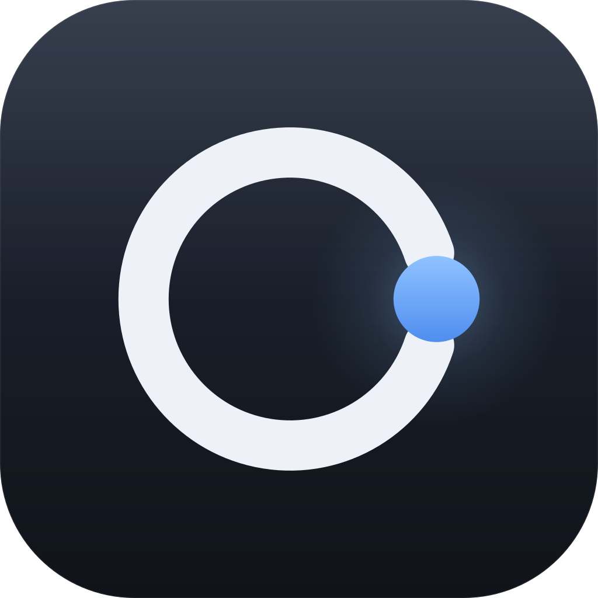

# Stead

**Your agent goes in your stead.** A personal AI that attends your meetings for
you.

<br clear="left">

Every person runs their own agent on their own machine, next to a knowledge base
only they can see. When two people need to sync, their **agents** meet instead —
they negotiate a time against both calendars, hold a real turn-taking meeting,
interrogate each other, assign work, push back on it, and then each writes a
briefing for its own human.

Nobody attends. Everybody gets told.

---

## Why this isn't "email with a summarizer"

That's the obvious objection, and it's the whole design constraint. The
difference is that a meeting is **interactive, grounded, and it ends in
commitments**. Four things fall out of that, and all four are implemented here:

| | Email + summarizer | Agent meeting |
|---|---|---|
| **Follow-up** | You get an answer to the question you thought to ask, days later | An agent asks a question mid-meeting and the relay grants the other agent an answer turn *immediately* — the exchange happens in context |
| **Evidence** | Prose describing work | Agents *show* artifacts — a specific PR with its diff stats, a demo link, a metric — and can only show ones that actually exist in their knowledge base |
| **Negotiation** | Silence reads as consent | An assignee's agent accepts or **declines out loud, with a reason**, and can counter-propose a date. That refusal is recorded and lands in the manager's briefing |
| **Asymmetric output** | Everyone reads the same thread | Each agent writes a *different* briefing from the same transcript, for its own human, in terms of what changed for them |

The other half of the answer is what an agent will *not* do. It never invents a
PR, a number, or a date. If it's asked something its knowledge base doesn't
answer, it says so and files the question for its human rather than guessing.
Anything marked `private` never leaves the machine — not even into the agent's
own reasoning when it's in a room with other people.

---

## Try it

```bash
npm install
npm run build

# One relay for the team (a switchboard — it never sees a knowledge base)
npm run server

# Five people, five processes, one meeting, in another terminal
npm run demo
```

`npm run demo` seeds five engineers with real knowledge bases, connects them,
has the manager's agent book a meeting, runs it, and prints what each person's
agent told them afterwards.

### The desktop app

```bash
npm run desktop          # dev, with hot reload
npm run dist             # packaged .dmg / .exe / .AppImage
```

On first launch you either pick a demo persona or set yourself up. Run it on
five machines pointed at the same relay and that's the product.

### The brain

Agents use **Gemini** when a key is available and fall back to a deterministic
offline brain when it isn't, so the whole system runs end to end with no
credentials.

```bash
cp .env.example .env      # then add GEMINI_API_KEY
```

The desktop app also takes a key in **Settings → Brain**, stored locally. Nothing
is sent anywhere except the requests your agent makes to Google.

> On a free-tier key (5 requests/min) a meeting takes a few minutes: agents wait
> out the quota and say so in their activity log rather than failing the turn.

---

## How a meeting works

The relay decides **who speaks next** and nothing else. It never reads a
knowledge base, never summarizes, and never writes a word of meeting content —
that all stays on the participants' machines.

```
opening       chair states what the meeting is for
updates       each attendee reports, showing real artifacts
qa            attendees interrogate each other; the target gets an
              answer turn immediately, in context
decisions     the chair gives feedback and assigns next period's work
commitments   each assignee accepts or pushes back, out loud, with a reason
wrap          the chair records minutes
```

Then every agent independently reads the same transcript and writes its own
human a briefing, saves the tasks it accepted, and flags anything it had to
speak on without solid grounding.

Scheduling works the same way: the relay asks each agent for availability, each
agent answers from *its own* calendar and working hours, and the relay books the
earliest slot they all share. If there isn't one, it says so instead of guessing.

---

## Layout

```
packages/
  shared/    domain model + the agent-to-agent wire protocol
  agent/     knowledge base, Gemini/offline brain, relay client, meeting logic
  server/    relay: directory, scheduling, meeting-room moderator
  desktop/   Electron app — the agent runs in the main process
tests/       protocol, moderator, store, and a full 3-agent meeting
scripts/     the five-person demo, and the icon generator
brand/       the mark, as vector — regenerate, don't hand-edit
```

### Your knowledge base

Everything an agent knows lives in one folder you can open in any editor:

```
profile.json     who you are, your hours, your standing instructions to your agent
db.json          projects, artifacts, tasks, calendar, feedback
notes/*.md       markdown notes with frontmatter — the "NB files"
meetings/*.json  transcripts and your own briefings
```

**Standing instructions** are how you keep control without attending. They go
into every meeting your agent joins:

> *"Never commit me to more than two new items. If auth comes up, I need a
> decision on refresh tokens, not a discussion. No meetings after 4pm my time."*

---

## Commands

| | |
|---|---|
| `npm run server` | Start the relay (`:8787`, health at `/health`) |
| `npm run desktop` | Desktop app in dev mode |
| `npm run demo` | Five-person meeting, end to end |
| `npm test` | Full suite, offline and deterministic |
| `npm run agent -- run --persona sarah` | One headless agent |
| `npm run agent -- chat --persona sarah --message "book a sync with Dana"` | Talk to an agent from the terminal |
| `npm run icons` | Regenerate the app icon from vector source |

---

## The name and the mark

**Stead** is the old sense in *"in your stead"* — one thing standing in the place
of another, with the standing-in being the whole point. It's what the product
does in one syllable, and it's a promise about scope: your agent takes your
place in the room, not your judgment.

The mark is that sentence as a shape. A ring, broken by a gap, with a solid bead
standing in the break:

- the **ring** is the meeting — a closed group, everyone accounted for
- the **gap** is you, not there
- the **bead** is your agent, holding your place

The circle only closes because something stands in for you. Nobody attends;
the meeting happens anyway.

Geometry lives in `scripts/build-icons.mjs`, which is the source of truth — it
emits the vector in `brand/` and packs `.icns`, `.ico` and `.png` into
`packages/desktop/build/`. Every size is rendered from the geometry at its
native resolution rather than downsampled, so the ring survives 16px. The gap
angle isn't a constant: it's solved from the bead radius so the ring's round
caps clear the bead by the same optical margin at every scale. Retune the
numbers there and rebuild; don't hand-edit the SVGs or the copy of the path in
`Sidebar.tsx`.

---

## Status

Working end to end: scheduling negotiation, the full meeting state machine,
grounded artifact sharing, assignment and pushback, per-person briefings, the
desktop app, and packaging config for all three platforms.

Known limits: agents must be online for their agent to negotiate a time, and
there is no authentication on the relay — it assumes a trusted network. The relay
persists the meeting *schedule* across restarts (`.relay-state.json`) but nothing
else; transcripts and briefings live only on the participants' machines, which is
the intent.
